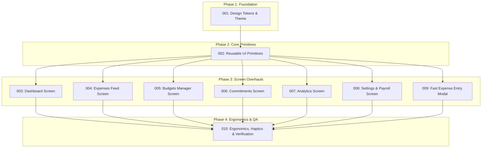

# Spending Tracker — UI/UX Redesign Master Plan

| | |
|---|---|
| **Status** | Approved — Blueprint Established |
| **Version** | 1.0 |
| **Date** | 2026-10-06 |
| **Source Specification** | `ui-redesign.pdf` (Comprehensive UI/UX Redesign Specification and Architecture Blueprint) |
| **Platform Target** | Mobile (iOS & Android) — Expo SDK 57, React Native 0.86, NativeWind v4, React Native Reusables |
| **Orchestrator Role** | Antigravity AI Orchestrator |

---

## 1. Executive Summary & Architectural Paradigm Shift

The Spending Tracker mobile application is transitioning from a passive, retrospective ledger into a forward-looking **Cash Flow Intelligence System**. Traditional personal finance trackers present uniform stacks of white containers against muted backgrounds, obscuring critical signals and forcing users to calculate daily liquidity manually.

Drawing inspiration from premier consumer fintech interfaces (**Revolut**, **Copilot Money**, **Apple Wallet**, **Linear**, and **Cash App**), the redesign introduces:

1. **Asymmetrical Bento Grid**: Functional grouping of net liquidity, forward liabilities, and category utilization into distinct, purposeful tiles.
2. **Obsidian Luxe & Swiss Porcelain Visual Language**:
   - Primary Dark: **Obsidian Luxe** (`#090B10`) paired with **Electric Mint** (`#10B981`) for OLED contrast and power optimization.
   - Light Theme: **Swiss Porcelain** (`#F8FAFC`) with crisp contrast.
   - Depth and elevation established via hairline borders (`border border-border/60`, 0.5pt equivalent) and tonal surface shifts rather than artificial heavy drop shadows.
3. **Tabular Monospace Typography (`tabular-nums`)**: Eliminates horizontal layout jitter during real-time balance calculations, currency formatting, and fast data entry.
4. **Deterministic Cash Flow Engine**: Daily discretionary allowance ($A_{\text{daily}}$) and Safe-to-Spend ($S_{\text{safe}}$) served as hero metrics.
5. **Zero-Latency Mobile Ergonomics**: Integer-sen calculations on-device, POS-style fast entry, dynamic safe areas, and tactile haptic feedback.

---

## 2. Invariant Domain Boundaries & Preservation Contracts

To maintain complete backward compatibility and system integrity, all redesign sessions must strictly preserve the following architectural invariants:

### 2.1 Domain Engine Immutability
The mathematical engine located in [`src/engine/`](file:///Users/ooiguancheng/Documents/projects/spending-tracker/src/engine/) is production-verified and strictly **immutable**. Redesign sessions must **never** alter computational logic within:
- [`src/engine/budgets.ts`](file:///Users/ooiguancheng/Documents/projects/spending-tracker/src/engine/budgets.ts): Monthly budget caps, category allocation ratios, and threshold indicators.
- [`src/engine/cashflow.ts`](file:///Users/ooiguancheng/Documents/projects/spending-tracker/src/engine/cashflow.ts): Safe-to-Spend algorithms and daily allowance formulas.
- [`src/engine/commitments.ts`](file:///Users/ooiguancheng/Documents/projects/spending-tracker/src/engine/commitments.ts): Amortization schedules, cycle status evaluation, and payment settlement logic.
- [`src/engine/totals.ts`](file:///Users/ooiguancheng/Documents/projects/spending-tracker/src/engine/totals.ts): Sen-level summation formulas and integer conversions.
- [`src/engine/boundaries.ts`](file:///Users/ooiguancheng/Documents/projects/spending-tracker/src/engine/boundaries.ts): Date boundaries, leap-year calculations, and month-end offsets.

### 2.2 Database Schema & Integer Sen Invariants
All SQLite database models and Drizzle ORM schemas in [`src/db/schema.ts`](file:///Users/ooiguancheng/Documents/projects/spending-tracker/src/db/schema.ts) must remain unchanged:
- **100 sen = 1.00 Malaysian Ringgit (RM)**. Currency values are stored, calculated, and communicated as integer sen. Floating point currency representations are strictly prohibited.
- `accounts`: `balance_sen` (Int), `is_credit` indicates revolving debt.
- `expenses`: `amount_sen` (Int), `linked_commitment_id` locks manual edit/deletion.
- `commitments`: `amount_sen`, `principal_sen`, `remaining_sen` (Int).
- `budgets`: `limit_sen` (Int).

### 2.3 Automated Test Contract Preservation
The application currently passes **65 test suites and 800+ unit tests**. Every existing `testID`, accessibility role, and contract marker must be preserved exactly as defined across all redesigned components.

```
┌──────────────────────────────────────────────────────────┐
│              PRESERVED TEST CONTRACT MATRIX             │
├──────────────────────────┬───────────────────────────────┤
│ Target Screen / Element  │ Preserved testID              │
├──────────────────────────┼───────────────────────────────┤
│ Dashboard Screen         │ testID="dashboard-screen"     │
│ Cash Flow Equation Card  │ testID="cashflow-formula-card"│
│ Upcoming Commitments     │ testID="upcoming-bills-card"  │
│ Budget Overall Card      │ testID="budget-overall-card"  │
│ AI Context Insight       │ testID="ai-daily-insight"     │
│ Expense Search Input     │ testID="expense-search-input" │
│ Period Summary Strip     │ testID="period-summary-strip" │
│ Expenses List Feed       │ testID="expenses-list"        │
│ Expense Row (Item)       │ testID="expense-row-{id}"     │
│ Category Budget Card     │ testID="category-card-{id}"   │
│ Category Limit Input     │ testID="category-limit-input" │
│ Loan Card Display        │ testID="loan-card-{id}"       │
│ Subscription Card        │ testID="subscription-card-{id}│
│ Obligation Card          │ testID="obligation-card-{id}" │
│ Mark as Paid Action      │ testID="mark-paid-button"     │
│ Analytics KPI Grid       │ testID="analytics-kpi-grid"   │
│ Analytics Categories     │ testID="analytics-categories" │
│ AI Analysis Review Card  │ testID="ai-analysis-card"     │
│ Accounts Stack Container │ testID="accounts-stack"       │
│ Payroll Trigger Button   │ testID="trigger-payroll-btn"  │
│ AI Configuration Section │ testID="ai-config-section"    │
│ POS Money Input          │ testID="money-input"          │
│ Account Deduction Pill   │ testID="account-pill-{id}"    │
│ Category Matrix Grid     │ testID="category-matrix"      │
│ Linked Commitment Lock   │ testID="linked-commitment-lock│
└──────────────────────────┴───────────────────────────────┘
```

---

## 3. Mathematical Cash Flow Formulation Reference

All screens that render cash flow state must adhere to the deterministic cash flow formulations:

$$B_{\text{avail}} = \sum_{a \in A_{\text{liquid}}} \text{Balance}(a) - \sum_{c \in A_{\text{credit}}} \text{Debt}(c)$$

$$C_{\text{unpaid}} = \sum_{i \in \text{Commitments}_{\text{active}}} \text{Amount}(i) \cdot \mathbb{I}(\text{DueDate}(i) \le T_{\text{end}} \land \neg \text{IsPaid}(i))$$

$$R_{\text{budget}} = \max(0, M_{\text{target}} - S_{\text{spent}})$$

$$S_{\text{safe}} = B_{\text{avail}} - C_{\text{unpaid}} - R_{\text{budget}}$$

$$A_{\text{daily}} = \frac{S_{\text{safe}}}{\max(1, D_{\text{rem}})}$$

### Visual Surface Treatment & Health State Mapping
| Health Classification | Mathematical Boundary | Visual Surface Treatment | Status Pill Label |
|---|---|---|---|
| **Healthy Surplus** | $S_{\text{safe}} > 0 \land A_{\text{daily}} > 0$ | Obsidian surface, Electric Mint hairline (`#10B981`) | `HEALTHY SURPLUS` |
| **Constrained Margin** | $S_{\text{safe}} > 0 \land A_{\text{daily}}$ constrained | Obsidian surface, Warm Amber hairline (`#F59E0B`) with amber tint | `TIGHT MARGIN` |
| **Deficit / Shortfall** | $S_{\text{safe}} \le 0$ | Obsidian surface, Vivid Rose hairline (`#F43F5E`) with crimson wash | `DEFICIT WARNING` |

---

## 4. Decomposed Feature Plans & Phased Roadmap

The redesign is decomposed into **10 granular, sequentially executable feature plans** housed in `redesign-docs/plans/`. Each plan is self-contained and designed to be executed by an autonomous subagent session.



### Feature Plan Registry

| Plan ID | Plan Document | Phase | Primary Objective | Target Files |
|---|---|---|---|---|
| **001** | [`001-design-tokens-and-theme.md`](file:///Users/ooiguancheng/Documents/projects/spending-tracker/redesign-docs/plans/001-design-tokens-and-theme.md) | Phase 1 | Design Tokens, Obsidian/Porcelain Palettes & Typography Scale | `tailwind.config.js`, `global.css`, `src/theme/*` |
| **002** | [`002-reusable-ui-primitives.md`](file:///Users/ooiguancheng/Documents/projects/spending-tracker/redesign-docs/plans/002-reusable-ui-primitives.md) | Phase 2 | Atomic Reusable Primitives (`MoneyDisplay`, `StatusPill`, `BudgetMeter`, `BentoCard`, `TouchTarget`, RNR styling) | `src/components/ui/*` |
| **003** | [`003-dashboard-screen.md`](file:///Users/ooiguancheng/Documents/projects/spending-tracker/redesign-docs/plans/003-dashboard-screen.md) | Phase 3 | Bento Grid Dashboard (`Hero Bento`, `Split Row`, `Budget Snapshot`, `AI Card`, `Action Dock`) | `src/app/(tabs)/index.tsx`, `src/components/dashboard/*` |
| **004** | [`004-expenses-feed-screen.md`](file:///Users/ooiguancheng/Documents/projects/spending-tracker/redesign-docs/plans/004-expenses-feed-screen.md) | Phase 3 | Audit Ledger (`Search & Filter Dock`, `Period Summary`, `Daily Grouped Cards`, `3-Col Rows`) | `src/app/(tabs)/expenses.tsx`, `src/components/expenses/*` |
| **005** | [`005-budgets-manager-screen.md`](file:///Users/ooiguancheng/Documents/projects/spending-tracker/redesign-docs/plans/005-budgets-manager-screen.md) | Phase 3 | Budgets Manager (`Overall Bento Card`, `2-Col Category Allocations Grid`, `Limit Sheet`) | `src/app/(tabs)/budgets.tsx`, `src/components/budgets/*` |
| **006** | [`006-commitments-screen.md`](file:///Users/ooiguancheng/Documents/projects/spending-tracker/redesign-docs/plans/006-commitments-screen.md) | Phase 3 | Digital Pass Commitments (`Loan`, `Subscription`, `Obligation`, `Mark as Paid` Settle Flow) | `src/app/(tabs)/commitments.tsx`, `src/components/commitments/*` |
| **007** | [`007-analytics-screen.md`](file:///Users/ooiguancheng/Documents/projects/spending-tracker/redesign-docs/plans/007-analytics-screen.md) | Phase 3 | Financial Analytics (`2x2 KPI Matrix`, `Category Breakdown Fill Bars`, `AI Review Card`) | `src/app/(tabs)/analytics.tsx`, `src/components/analytics/*` |
| **008** | [`008-settings-accounts-payroll-screen.md`](file:///Users/ooiguancheng/Documents/projects/spending-tracker/redesign-docs/plans/008-settings-accounts-payroll-screen.md) | Phase 3 | Settings, Accounts & Payroll (`Stacked Cards`, `Payroll Allocation Engine`, `BYOK AI Radio`) | `src/app/(tabs)/settings.tsx`, `src/components/settings/*` |
| **009** | [`009-fast-expense-entry-modal.md`](file:///Users/ooiguancheng/Documents/projects/spending-tracker/redesign-docs/plans/009-fast-expense-entry-modal.md) | Phase 3 | Fast Modal Entry & Edit (`POS Keypad`, `Balance Preview`, `Category Matrix`, `Commitment Lock`) | `src/app/expenses/new.tsx`, `src/app/expenses/[id]/edit.tsx` |
| **010** | [`010-ergonomics-haptics-verification.md`](file:///Users/ooiguancheng/Documents/projects/spending-tracker/redesign-docs/plans/010-ergonomics-haptics-verification.md) | Phase 4 | Mobile Ergonomics, Dynamic Insets, Haptics Mapping & End-to-End Test Suite Verification | App-wide, `src/utils/haptics.ts`, Jest suite |

---

## 5. Multi-Session Orchestrator Protocol

As the **Orchestrator**, Antigravity coordinates independent execution sessions for each feature plan, reviewing session outputs, verifying contracts, and enforcing gating standards.

### 5.1 Session Execution Cycle

```
[Orchestrator]
       │
       ▼  1. Dispense Target Plan (e.g. Plan 001)
[New Session Agent]
       │  2. Read redesign-docs/plans/NNN-*.md
       │  3. Implement Changes in Codebase
       │  4. Run Verification (tsc, lint, jest)
       │  5. Generate Standardized Handoff Report
       ▼
[Orchestrator]
       │  6. Validate Test Contracts & Engine Immutability
       │  7. Update MASTER_PLAN Status Registry
       ▼
[Next Session Agent] (e.g. Plan 002)
```

### 5.2 Session Kickoff Standard
When a new session begins for Plan `NNN`:
1. The session agent reads:
   - This document: [`redesign-docs/MASTER_PLAN.md`](file:///Users/ooiguancheng/Documents/projects/spending-tracker/redesign-docs/MASTER_PLAN.md)
   - The specific plan: `redesign-docs/plans/NNN-*.md`
   - [`AGENTS.md`](file:///Users/ooiguancheng/Documents/projects/spending-tracker/AGENTS.md)
2. The session agent checks existing test state before making any modifications:
   ```bash
   npm test
   ```
3. The session agent performs modifications strictly confined to the plan's scope.
4. The session agent runs the verification suite:
   ```bash
   npm run typecheck
   npm run lint
   npm test
   ```

### 5.3 Standardized Session Handoff Report
Upon completion, each session MUST output a structured handoff report in the following format:

```markdown
### Session Handoff Report: Plan [NNN] — [Plan Name]
- **Status**: [Completed / Blocked]
- **Files Modified / Created**:
  - `path/to/file1.ts`
  - `path/to/file2.tsx`
- **Preserved Test Contracts Verified**:
  - [x] testID="contract-1"
  - [x] testID="contract-2"
- **Verification Commands Executed**:
  - `npm run typecheck`: [PASS]
  - `npm run lint`: [PASS]
  - `npm test`: [PASS (X suites passed, Y tests passed)]
- **Engine & Schema Invariant Confirmation**:
  - [x] `src/engine/*` files untouched
  - [x] `src/db/schema.ts` untouched
  - [x] All monetary amounts handled in integer sen
- **Handoff Notes for Next Session**:
  - [Any notes, shared tokens, or primitives ready for consumption]
```

### 5.4 Orchestrator Quality Gate
The Orchestrator will review the handoff report and execute automated verification:
1. Ensure zero changes to `src/engine/*` and `src/db/schema.ts`.
2. Confirm all preserved test IDs are intact.
3. Validate that test suite continues to pass without regressions (65/65 suites, 800+ tests).
4. Mark the feature plan as **Completed** in the registry.

---

## 6. Implementation Progress Tracking

| Plan | Feature Name | Phase | Session Status | Gate Review |
|---|---|---|---|---|
| **001** | Design Tokens & Theme | Phase 1 | Completed | Verified (816 tests pass) |
| **002** | Reusable UI Primitives | Phase 2 | Completed | Verified (845 tests pass) |
| **003** | Dashboard Screen | Phase 3 | Completed | Verified (845 tests pass) |
| **004** | Expenses Feed Screen | Phase 3 | Completed | Verified (847 tests pass) |
| **005** | Budgets Manager Screen | Phase 3 | Completed | Verified (865 tests pass) |
| **006** | Commitments Screen | Phase 3 | Completed | Verified (869 tests pass) |
| **007** | Analytics Screen | Phase 3 | Completed | Verified (869 tests pass) |
| **008** | Settings, Accounts & Payroll Screen | Phase 3 | Completed | Verified (869 tests pass) |
| **009** | Fast Expense Entry Modal | Phase 3 | Completed | Verified (871 tests pass) |
| **010** | Mobile Ergonomics, Haptics & Verification | Phase 4 | In Progress | Pending |
